# Criação da Task Terraform no Semaphore (Repositório Privado)

Este documento registra o fluxo real adotado para executar o provisionamento de LXC via Terraform no Semaphore UI, com código hospedado em **repositório privado separado no GitHub**.

O objetivo desta etapa foi validar a esteira completa com segurança:

1. Conectar o Semaphore ao repositório privado.
2. Configurar as variáveis de ambiente necessárias (Proxmox e Vault).
3. Criar a task de automação para provisionamento.
4. Rodar primeiro um **plano simulado** para análise de logs.
5. Executar o provisionamento automático no cluster após validação.

> **Pré-requisito**
> Antes desta etapa, é necessário concluir as parametrizações do tutorial anterior: [docs/tutoriais/6-CONFIGURACAO_TERRAFORM_SEMAPHORE.md](./6-CONFIGURACAO_TERRAFORM_SEMAPHORE.md).

---

## 1. Contexto da Execução

Para isolar a automação de provisionamento, o código Terraform foi colocado em um **repositório próprio e privado** no GitHub. Isso trouxe duas vantagens práticas:

1. Separação de responsabilidades entre documentação/automação e infraestrutura.
2. Controle de acesso mais restrito para credenciais, fluxo de alteração e histórico da pipeline.

Além disso, antes da execução automatizada, foi criado manualmente no Proxmox o pool **turma-a** para organizar os contêineres do teste.

Evidências da preparação do repositório e da estrutura Terraform:

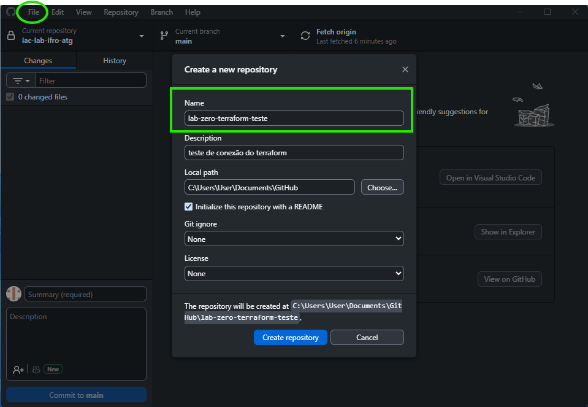
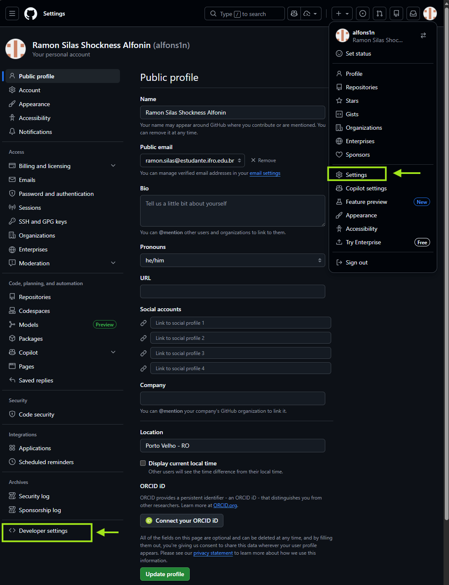
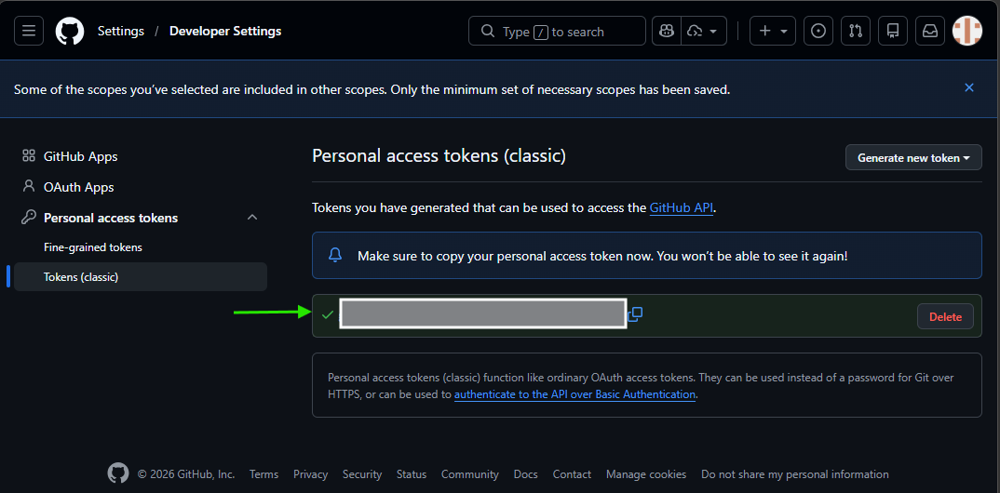
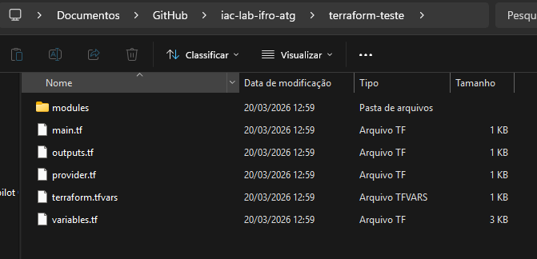

Evidência da organização prévia no Proxmox com pool de teste:

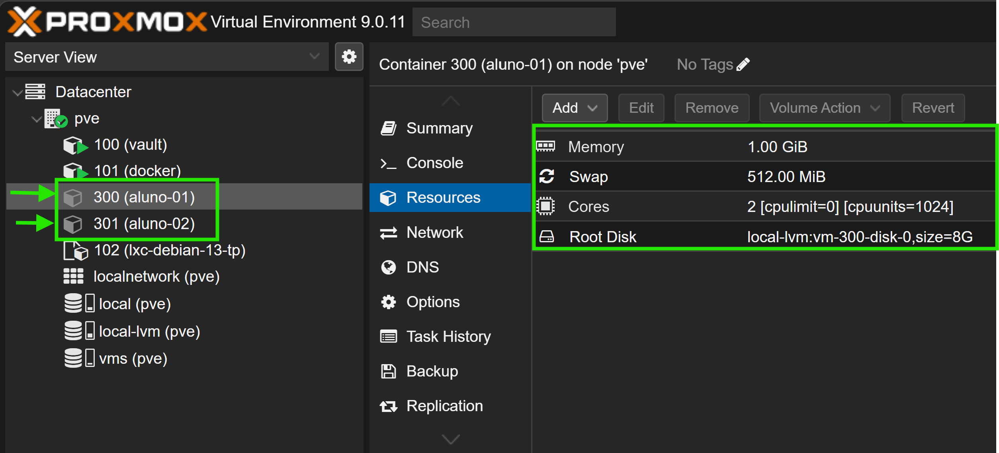

---

## 2. Configuração do Semaphore para Acessar o Repositório Privado

Com o repositório privado pronto, foi feita a configuração do Semaphore em três partes:

1. Cadastro do repositório GitHub no projeto.
2. Configuração da chave/credencial de acesso ao GitHub no Key Store.
3. Associação final do repositório ao fluxo da task.

Evidências dessa configuração:

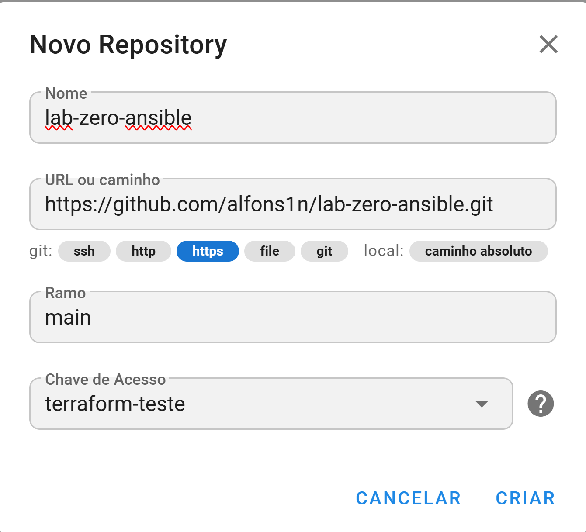
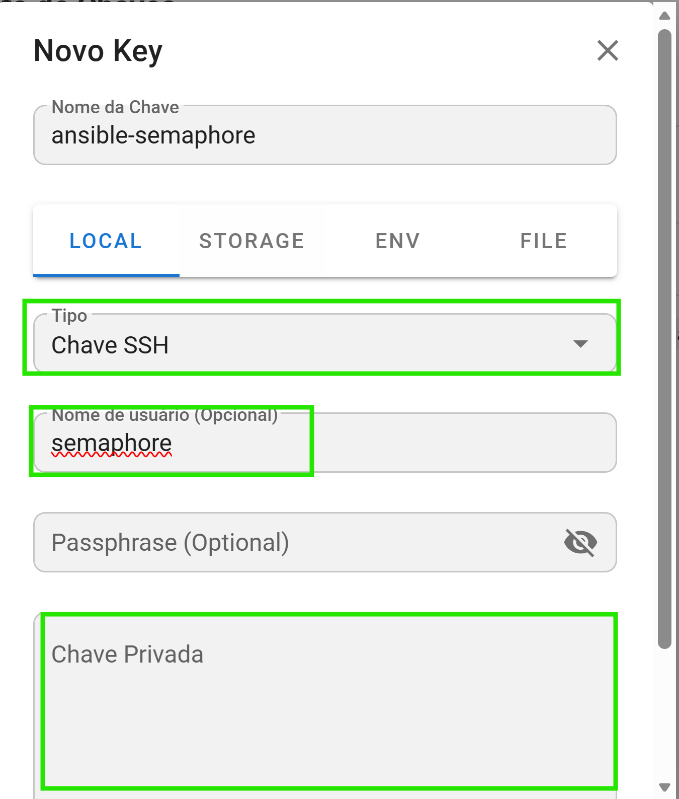
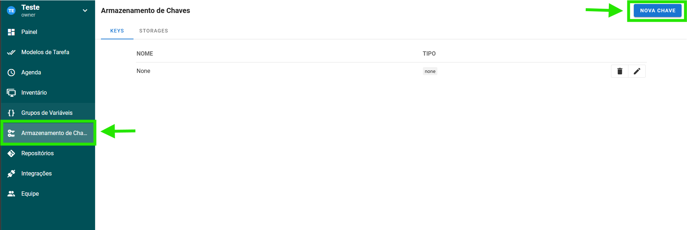
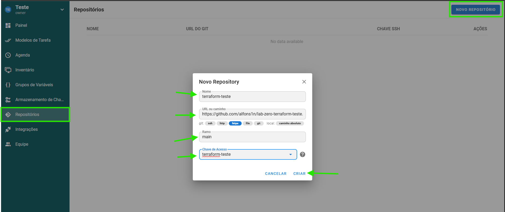

---

## 3. Configuração das Variáveis de Ambiente

Depois da integração com o GitHub, foram cadastradas no Semaphore as variáveis de ambiente que alimentam o Terraform e o acesso ao Vault.

O grupo de variáveis incluiu parâmetros de conexão e de infraestrutura, conforme os arquivos da pasta `terraform/` (camada `layers/02-alunos/` e módulo `modules/lxc/`).

Evidências da configuração das variáveis:

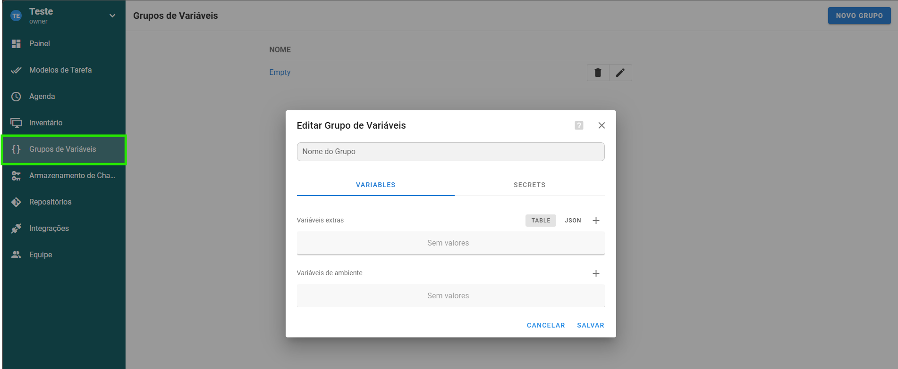
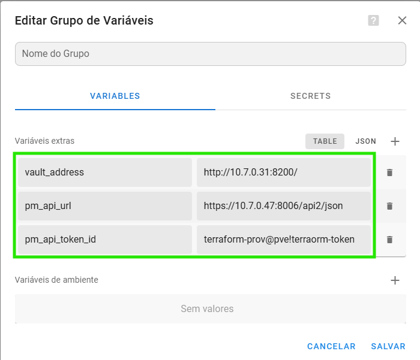
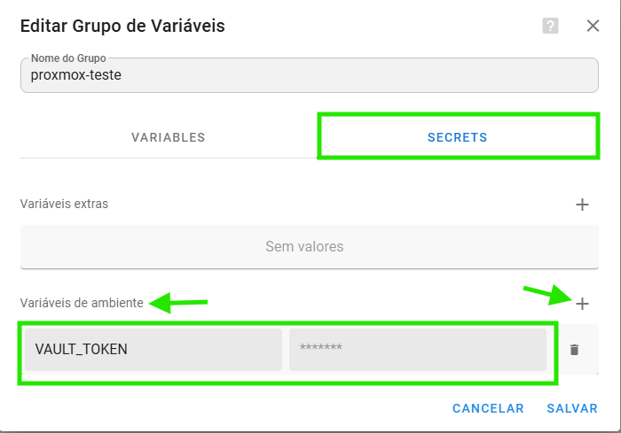

---

## 4. Criação da Task de Provisionamento

Com repositório e variáveis definidos, foi criado o template de tarefa no Semaphore para executar o Terraform.

A task foi configurada para apontar para o diretório do código Terraform no repositório privado e executar o fluxo padrão de planejamento e aplicação.

Evidências da criação da task:

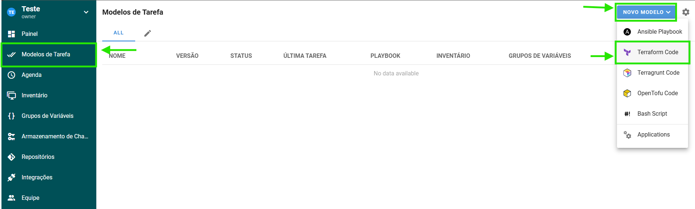
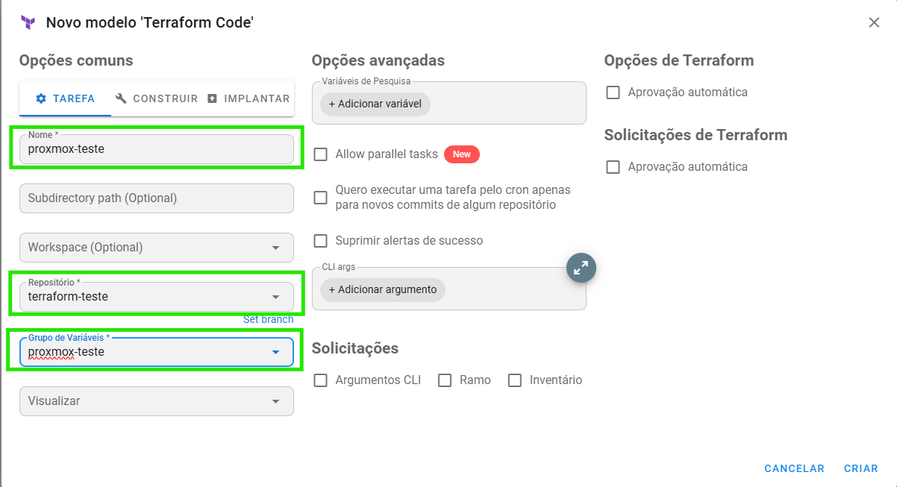

---

## 5. Plano Simulado (Validação Segura)

Antes de alterar o cluster, foi executado um **plano simulado** (`Plan`) para validar:

1. Leitura das variáveis de ambiente.
2. Acesso ao Vault e ao Proxmox.
3. Recursos que seriam criados pelo Terraform.

Essa etapa evitou mudanças prematuras e permitiu analisar os logs com segurança.

Exemplo do tipo de saída esperada no plano com o provider atual (`bpg/proxmox`):

```diff
Terraform will perform the following actions:

+ resource "proxmox_virtual_environment_container" "infra_service" {
    + vm_id        = (known after apply)
    + node_name    = "testpve01"
    + unprivileged = true
    + pool_id      = "turma-a"
    + tags         = ["IAC", "aluno", "turma-a"]
    # ... blocos cpu, memory, initialization, disk e operating_system ...
  }

+ resource "proxmox_virtual_environment_container" "infra_service" {
    + vm_id        = (known after apply)
    + node_name    = "testpve02"
    + unprivileged = true
    + pool_id      = "turma-a"
    # ... segunda instância do for_each ...
  }

Plan: 2 to add, 0 to change, 0 to destroy.
```

Evidências do momento de execução em modo de validação:

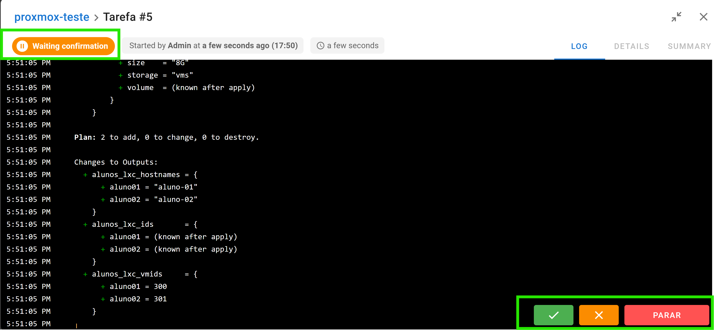
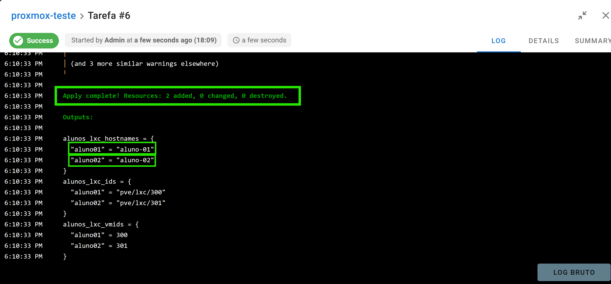

---

## 6. Provisionamento Automático e Comprovação de Sucesso

Após validar o plano simulado e conferir os logs, o provisionamento automático foi executado.

O resultado confirmou:

1. Criação dos dois contêineres previstos.
2. Organização no pool `turma-a`.
3. Saída de `outputs` com os IPs esperados.

Evidências finais (logs e imagens):

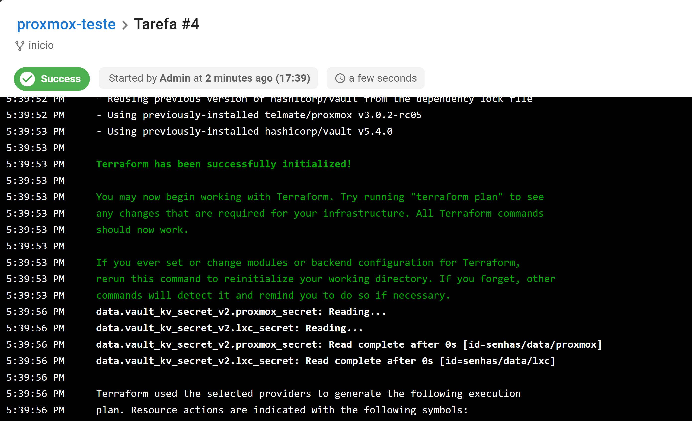
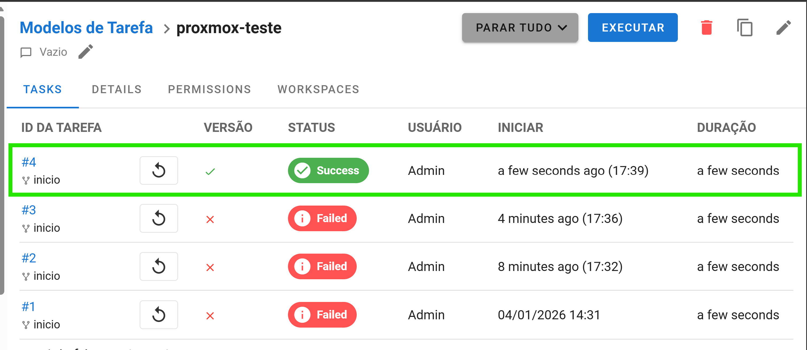
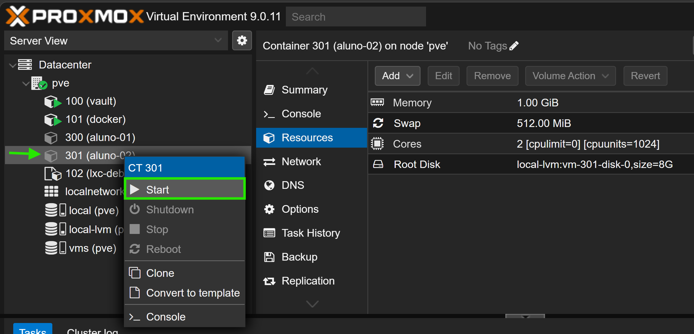

Com isso, o fluxo **Semaphore + GitHub privado + Terraform + Vault + Proxmox** foi validado com sucesso, de forma rastreável e segura para uso em laboratório.
